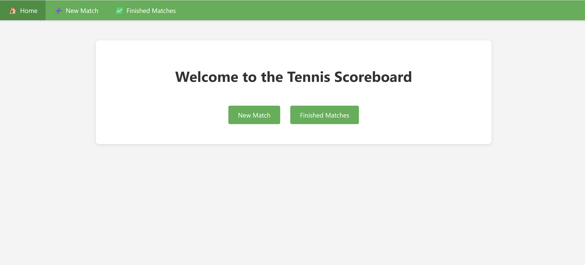
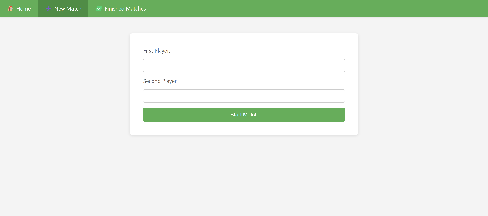
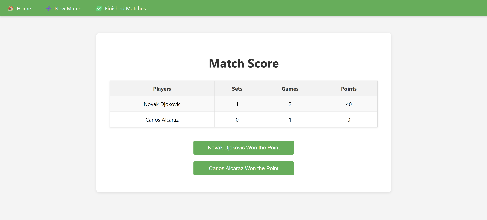
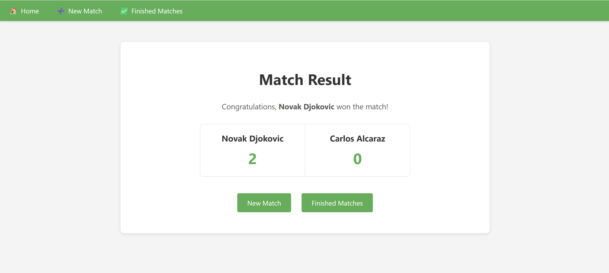
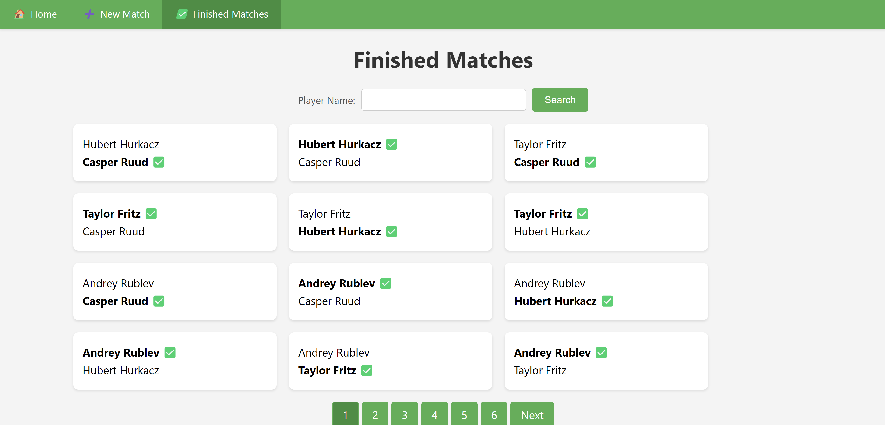
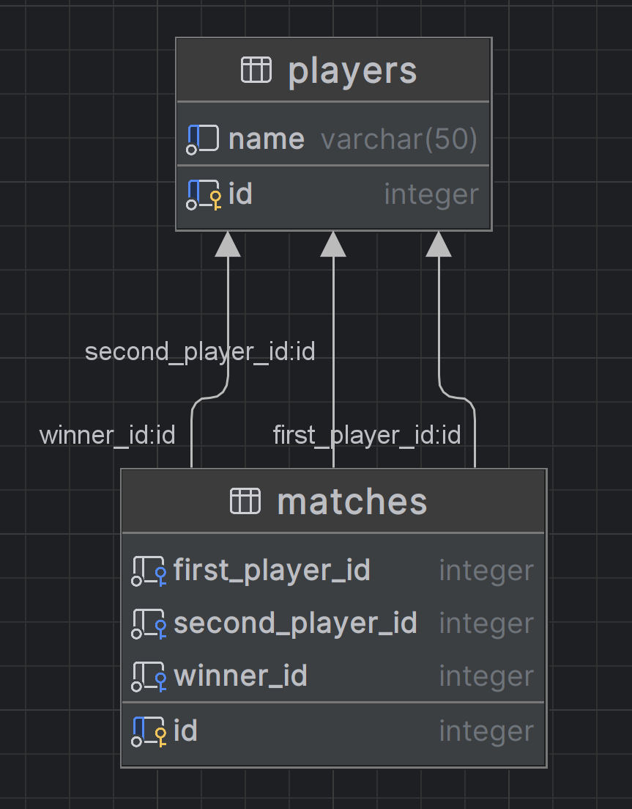

# Tennis Scoreboard

## Overview

The Tennis Scoreboard is a web application that implements a scoreboard for tracking the scores of tennis matches. It allows users to create new matches, view completed matches, and manage ongoing matches by updating scores in real-time.

## Technologies

- **Java 17**
- **Jakarta EE**
- **Hibernate**
- **PostgreSQL**
- **Tomcat**
- **Docker / Docker Compose**
- **Maven**
- **Flyway**
- **Junit5**
- **JSP**
- **HTML**
- **CSS**

## Interface







## Database Diagram




## Local project startup

To start the project locally, use the provided [docker-compose.yml](docker-compose.yml) file. This setup is intended for
development and testing purposes on a local machine.

**Key Points:**

- **Docker Containers:** The local startup configuration includes Docker container with PostgreSQL.
- **Tomcat:** You will need to install and configure Tomcat manually or run it using IntelliJ IDEA.

**Steps to Run the project locally:**

1. Ensure you have Docker and Docker Compose installed.
2. Open your terminal in the project's root directory and run the following command to start the Docker containers in
   detached mode:
   ```bash
   docker-compose up -d
3. Run Tomcat using IntelliJ IDEA.

You can also use Docker Desktop for convenience.

## Deployment

**Key Points:**

- **Docker Containers:** The server deployment configuration includes Docker containers for PostgreSQL and Tomcat.

For server deployment, use the [docker-compose.prod.yml](docker-compose.prod.yml) file.

**Steps to Deploy on a server:**

1. Ensure you have Docker and Docker Compose installed on your server.
2. Copy `docker-compose.prod.yml`, `.env` to your server.
3. Navigate to the directory where the docker-compose.prod.yml file is located.
4. Run the following command to start the Docker containers in detached mode:

   ```bash
   docker-compose -f docker-compose.prod.yml up -d
   ```

## Contributing

Contributions are welcome! Please fork this repository and submit a pull request

## License

This project is licensed under the MIT License. See the [LICENSE](LICENSE) file for details.


